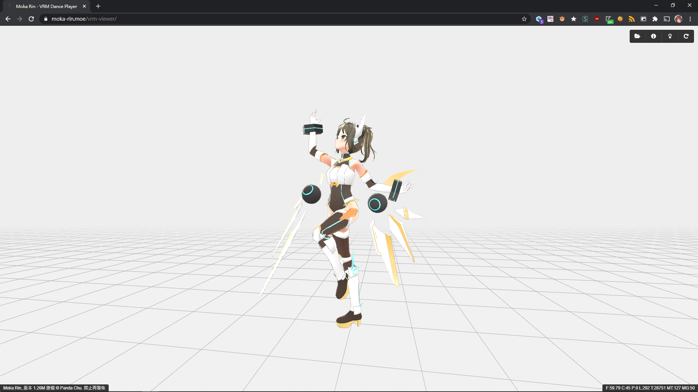

# VRM Dance Player

This is a tiny project that makes preview of VRM models. VRM is a [3D avatar file format for VR](https://vrm.dev/en/), which is for handling 3D humanoid character/avatar data cross platform.

This project uses [three.js](https://threejs.org/), [three-VRM](https://github.com/pixiv/three-vrm) and some custom code for converting and handling [MikuMikuDance VMD motion data](https://mikumikudance.fandom.com/wiki/VMD_file_format). The base of this project uses [this template by Johannes Bauer](https://github.com/Joh4nnesB/threejs-typescript-webpack).

To use this project, just head into [this size](https://moka-rin.moe/vrm-viewer/) and drop your VRM and VMD files to the scene and that's it!

There also has a experimental handler for [Biovision Hierarchy (BVH) motion capture files](https://en.wikipedia.org/wiki/Biovision_Hierarchy), you may try to load them like the VMD files but it is not guarantee to work ~~(in most cases, all joints will messed up)~~.

# Screenshots

*The character in this screenshot is not included. [Original reference](https://hub.vroid.com/characters/4744669501802908201/models/2299592336090647140)

# License

[MIT](LICENSE)